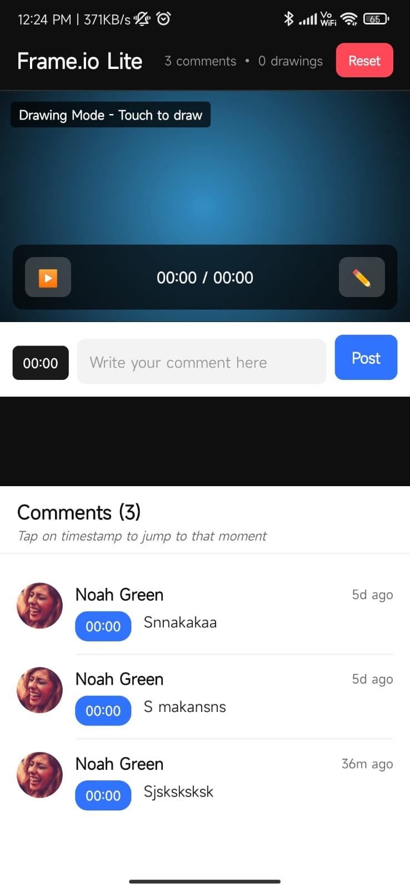

# Frameio App

Frameio is a collaborative video review and sharing mobile application designed to streamline media workflows. Built with [Expo](https://expo.dev/) and React Native, Frameio enables teams to upload, comment, and approve video content efficiently from their mobile devices.

## Project Description

Frameio helps creative teams manage video projects by providing tools for feedback, versioning, and secure sharing. The app integrates with popular editing software and supports various media formats, making it easy for teams to collaborate on the go.

### 🔷 App Icon


## Features

- Upload and share video content
- Time-stamped comments and feedback
- Version control for media files
- Team collaboration and notifications
- Secure access and sharing options
- Integration with editing software

## Installation

1. **Clone the repository:**
    ```bash
    git clone https://github.com/sushantdwivedi/Frame-io.git
    cd frameio-mobile
    ```

2. **Install dependencies:**
    ```bash
    npm install
    ```

3. **Start the Expo development server:**
    ```bash
    npx expo start
    ```

4. **Run on your device:**
    - Scan the QR code with the Expo Go app (iOS/Android) or use an emulator.

## Usage Example

- Upload a video from your device.
- Invite team members to review and comment.
- View time-stamped feedback and approve versions.
- Share secure links to finalized media.

## 📸 Screenshots

### 🖥️ Home Page



## Folder Structure

```
frameio-mobile/
├── assets/           # Images, icons, and media assets
├── src/
│   ├── components/   # Reusable UI components
│   ├── screens/      # App screens (pages)
│   ├── hooks/        # Custom React hooks
│   ├── utils/        # Utility functions
│   ├── services/     # API calls and services
│   ├── navigation/   # Navigation setup
│   └── App.js        # Main app entry point
├── app.json          # Expo configuration
├── package.json      # Project metadata and scripts
└── README.md         # Project documentation
```

## Contributing

Contributions are welcome! Please open issues or submit pull requests for improvements and new features. Follow the code style and add tests where applicable.

## License

This project is licensed under the MIT License.

## Contact

For questions or support, contact [sushant.dwivedi.dev@gmail.com](mailto:sushant.dwivedi.dev@gmail.com).
